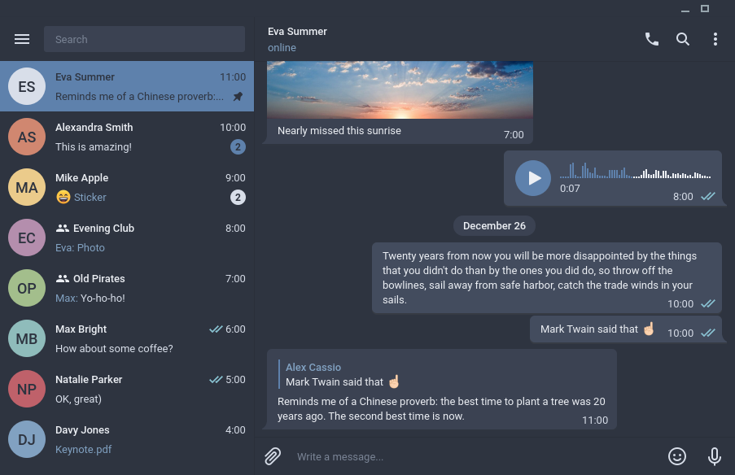

# Dark Nord Theme for Telegram Desktop

This repo contains a nord (https://github.com/arcticicestudio/nord) based dark theme for telegram desktop.

This theme was forked from [Nord Theme](https://github.com/gilbertw1/telegram-nord-theme).

## Preview

## Install

- From [this link](https://t.me/addtheme/hxjeRMNshYOmX18y)
- From the instructions in the original theme
- Downloading the theme from this repository
  - Go to Settings > Chat > 3 dots in bar (kebab menu) > Create new theme
  - In the newly opened right menu, click on the kebab menu and select "import
   theme"
   - Select the colors.tdesktop-theme downloaded from this repository
   - Back to chat settings, under "Chat background" click on "Choose from file"
   and select the file "tile.png" downloaded from this repository
   - Make sure the "Tile background" option is selected
